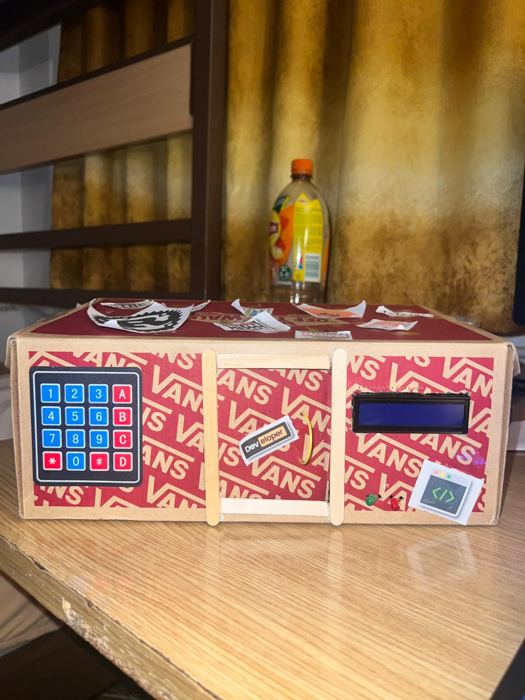

# 🔐 SecureStash – A Rust-Based Smart Safe Lock

**SecureStash** is a secure locking system built with **Rust** and the **Raspberry Pi Pico**, designed to protect your valuables using a keypad-based authentication system. With a sleek servo lock, LED indicators, buzzer alerts, and a 1602 LCD display, the system provides real-time feedback for access control in a compact embedded solution.

Developed as part of an embedded systems project, SecureStash combines real-world hardware with async Rust programming to deliver a responsive, tamper-aware locking system.

---

## ✨ Features

* 🔢 **4x4 Keypad Input** to enter access codes
* 🟢 **Green LED + LCD Message** for successful unlock
* 🔴 **Red LED + Buzzer** on incorrect PIN
* 🔐 **Secure PIN Logic**:

  * `"123A"` – unlocks the safe (opens servo)
  * `"456B"` – locks the safe (closes servo)
  * Any other code – triggers alarm
* 🔊 **Audible Feedback** via buzzer
* 💡 **Visual Feedback** via 1602 LCD and LEDs
* ⚙️ **Servo Control** to rotate lock arm
* ⚡ Runs entirely on the **Raspberry Pi Pico** with async timing

---

## 🧰 Hardware Used

| Component          | Description                            |
| ------------------ | -------------------------------------- |
| Raspberry Pi Pico  | Main microcontroller                   |
| 4x4 Matrix Keypad  | User input for PIN code                |
| 1602 I2C LCD       | Displays status messages               |
| SG90 Servo Motor   | Physically locks/unlocks the mechanism |
| Red & Green LEDs   | Show success or failure visually       |
| Buzzer             | Audible alarm on incorrect code        |
| Breadboard & Wires | For prototyping connections            |

---

## 🧠 How It Works

1. ✅ The user enters a 4-character code via the keypad.
2. 📟 The LCD displays the current input live.
3. 🎯 After 4 characters, the system evaluates the code:

   * `"123A"`: unlocks via servo and green LED.
   * `"456B"`: locks via servo and green LED.
   * ❌ Any other code: triggers red LED + buzzer + LCD warning.
4. 🔄 The system resets after each action, ready for the next code.

---

## 📦 Wiring & Code Setup

### 🔌 GPIO Configuration

```rust
let mut column_1 = Output::new(peripherals.PIN_19, Level::Low);
let mut column_2 = Output::new(peripherals.PIN_18, Level::Low);
let mut column_3 = Output::new(peripherals.PIN_17, Level::Low);
let mut column_4 = Output::new(peripherals.PIN_16, Level::Low);

let mut row_1 = Input::new(peripherals.PIN_26, Pull::Up);
let mut row_2 = Input::new(peripherals.PIN_22, Pull::Up);
let mut row_3 = Input::new(peripherals.PIN_21, Pull::Up);
let mut row_4 = Input::new(peripherals.PIN_20, Pull::Up);

let mut green_led = Output::new(peripherals.PIN_0, Level::Low);
let mut red_led = Output::new(peripherals.PIN_3, Level::Low);
let mut buzzer = Output::new(peripherals.PIN_1, Level::Low);
let mut pwm_output = Output::new(peripherals.PIN_2, Level::Low); // for servo
```

---

### 🔁 Keypad Reading Loop (Simplified)

```rust
while keypad_code.len() < 4 {
    for column_index in 0..4 {
        // Set current column LOW
        // Read each row to detect press
        if row_1.is_low() { push("1"); }
        if row_2.is_low() { push("2"); }
        ...
        // Update LCD with typed code
    }
}
```

---

### 🔐 PIN Evaluation Logic

```rust
if keypad_code == "123A" {
    move_servo_180_degrees().await;
    green_led.set_high();
    lcd.print("✅ Unlocked");
} else if keypad_code == "456B" {
    move_servo_back_180_degrees().await;
    green_led.set_high();
    lcd.print("🔒 Locked");
} else {
    buzzer.set_high();
    red_led.set_high();
    lcd.print("❌ Access Denied");
}
```

---

## 📸 Final Hardware Setup



---

## 🛠 How to Build and Run

1. Open terminal in the project directory:

   ```bash
   cd project
   ```
2. Build with Cargo:

   ```bash
   cargo build
   ```
3. Flash the `.uf2` using `probe-rs`, `elf2uf2`, or VS Code Pico plugin.

---

## 🔗 Related Resources

1. [📚 Project Inspiration – RFID Lock (Student Project)](https://ocw.cs.pub.ro/courses/pm/prj2022/arosca/rfid-lock)
2. [🔐 Door Lock System on YouTube](https://www.youtube.com/watch?v=kGyQS3B1IwU)
3. [🚨 Anti-theft Servo Lock Tutorial](https://www.youtube.com/watch?v=Jg0W165iHYk)

---

## 💡 Author

- **RÂPA Denis-Andrei** - [GitHub Profile](https://github.com/adenis033)
